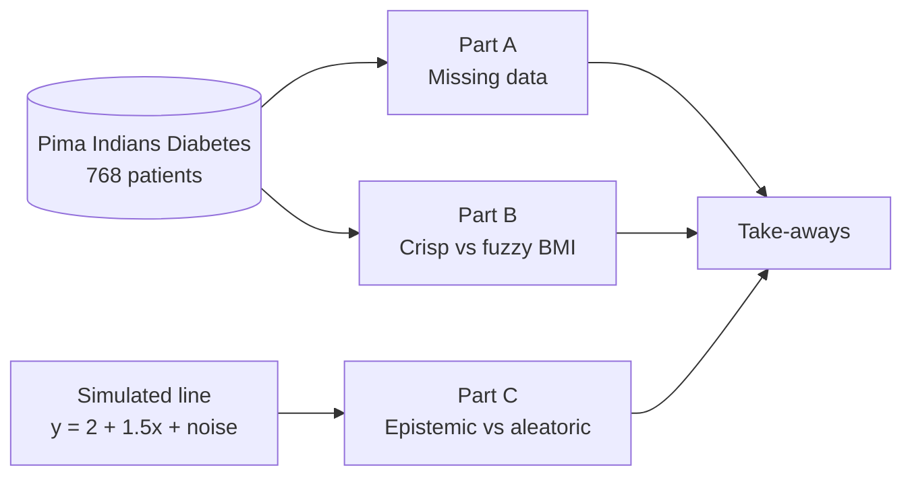

# Advanced AI and Uncertainty

**What happens to an AI system when its data are noisy, vague, imprecise or incomplete?**
A presentation, executive summary and live demo for *CS405, Presentation 1 (Week 1)*, built on real medical data.

[](https://colab.research.google.com/github/ahmedtayel714/Advanced-AI-and-Uncertainty--W1/blob/main/W01_UncertaintyDemo_Team01_MyBuild.ipynb)
[](https://github.com/ahmedtayel714/Advanced-AI-and-Uncertainty--W1/actions/workflows/notebooks.yml)


| | |
| --- | --- |
| **Author** | Ahmed Ayman Tayel, Team Leader, Team 01 |
| **Institution** | College of Computers and Artificial Intelligence, Matruh University |
| **Domain** | Medicine (diabetes screening data) |
| **Presentation date** | 4 October 2026 |
| **Dataset** | Pima Indians Diabetes Database, 768 patients |

## Contents

- [Overview](#overview)
- [Results at a glance](#results-at-a-glance)
- [Quick start](#quick-start)
- [Repository structure](#repository-structure)
- [The demo in three parts](#the-demo-in-three-parts)
- [Data](#data)
- [Reproducibility and testing](#reproducibility-and-testing)
- [Presentation materials](#presentation-materials)
- [Limitations](#limitations)
- [Roadmap](#roadmap)
- [AI assistance](#ai-assistance)
- [References](#references)
- [License](#license)

## Overview

Real data are rarely clean. This project asks how an AI system should reason when it cannot trust its inputs, and answers with three ideas:

1. **Uncertainty has several sources.** Randomness, vagueness, imprecision and missing data are different problems and need different tools.
2. **Not all doubt can be removed.** *Aleatoric* uncertainty (noise in the world) stays however much data we collect. *Epistemic* uncertainty (doubt in the model) shrinks as data grow.
3. **Crisp logic, fuzzy logic and probability answer different questions.** A crisp rule jumps at a threshold, a fuzzy set gives a degree of membership, and probability describes chance and missing information. A degree of membership is **not** a probability.

The talk has eight parts, from the AI landscape to the link with the rest of the course. The live demo in this repository turns the central ideas into code and numbers that anyone can re-run.



## Results at a glance

| Part | Question | Result |
| --- | --- | --- |
| A. Missing data | How much is missing? | pandas reports **0** missing cells, but **374 of 768** insulin values (**48.7%**) are hidden zeros, and **376** patients have at least one impossible zero. |
| A. Missing data | What does each fix cost? | Deleting incomplete rows keeps **392 of 768** patients (51.0%). Mean imputation keeps everyone but shrinks the spread of insulin from **118.8 to 85.0**. |
| B. Crisp vs fuzzy | Do two almost identical patients get similar answers? | BMI 29.9 and 30.1 get **0 and 1** from the crisp rule but **0.48 and 0.52** from the fuzzy definition. |
| C. Epistemic vs aleatoric | What does more data fix? | The spread of the prediction at x = 5 falls from **0.68** to **0.22** to **0.07** for n = 20, 200, 2,000, while the noise stays near **3**. |

<p align="center">
  
</p>

## Quick start

### In Google Colab (no installation)

1. Open the notebook: [**Open W01_UncertaintyDemo_Team01_MyBuild.ipynb in Colab**](https://colab.research.google.com/github/ahmedtayel714/Advanced-AI-and-Uncertainty--W1/blob/main/W01_UncertaintyDemo_Team01_MyBuild.ipynb), or scan the QR code below.
2. Choose **Runtime > Run all**. A full run takes about 30 seconds.


### On your own computer

```bash
git clone https://github.com/ahmedtayel714/Advanced-AI-and-Uncertainty--W1.git
cd Advanced-AI-and-Uncertainty--W1

python -m venv .venv
source .venv/bin/activate          # Windows: .venv\Scripts\activate
pip install -r requirements.txt jupyterlab

jupyter lab
```

Open one of the notebooks and run all cells. An internet connection is needed once per run, because the data are downloaded when the notebook starts.

## Repository structure

```text
.
├── README.md
├── LICENSE
├── requirements.txt
├── W01_UncertaintyDemo_Team01_MyBuild.ipynb   # the author's demo notebook (opened by the QR code)
├── W01_UncertaintyDemo_Team01.ipynb           # reference version of the same demo
├── W01_ExecutiveSummary_Team01.pdf            # one-page executive summary
├── slides/
│   ├── W01_AdvancedAI_Uncertainty_Team01.pdf  # 29-slide deck (PDF)
│   └── W01_AdvancedAI_Uncertainty_Team01.pptx # 29-slide deck (PowerPoint export)
├── figures/                                   # figures used on the slides
│   └── mybuild/                               # figures produced by the author's notebook
├── assets/                                    # QR code for the Colab notebook
├── docs/                                      # study guide and build blueprint
└── .github/workflows/notebooks.yml            # runs both notebooks on every push
```

| Notebook | Purpose |
| --- | --- |
| `W01_UncertaintyDemo_Team01_MyBuild.ipynb` | The demo used in the presentation: 17 steps from loading the data to the final figure. Written step by step by the author. |
| `W01_UncertaintyDemo_Team01.ipynb` | A complete reference version of the same analysis, with extra figures (characteristic function, temperature example). |

## The demo in three parts

### Part A. Missing data: the visible count and the hidden count

A first check says the table is complete. Domain knowledge says otherwise: a living patient cannot have a blood pressure, glucose or BMI of exactly 0. In five columns the value 0 is a disguised "not measured".

- Count the zeros in `Glucose`, `BloodPressure`, `SkinThickness`, `Insulin` and `BMI`, then recode them as real missing values (`NaN`). `Pregnancies = 0` is legitimate and stays.
- Show where the gaps are with a heatmap: missing values cluster in the same patients, so the data are unlikely to be missing completely at random.
- Compare missingness between the two outcome groups. This is a hint about the mechanism (MCAR, MAR, MNAR), never a proof.
- Compare four ways to handle `Insulin` and what each costs, and add an indicator column `Insulin_missing`.

| Strategy | Rows kept | Mean insulin | SD insulin |
| --- | --- | --- | --- |
| Delete rows with any missing value | 392 | 156.1 | 118.8 |
| Delete only rows missing insulin | 394 | 155.5 | 118.8 |
| Mean imputation | 768 | 155.5 | 85.0 |
| Median imputation | 768 | 140.7 | 86.4 |

Deleting costs information, imputation costs honesty about uncertainty, and neither is free.


### Part B. One variable, two definitions of "obese"

A **crisp** rule says a patient is obese when BMI is at least 30. A **fuzzy** definition lets the degree of "obese" rise smoothly from 0 at BMI 27 to 1 at BMI 33:

$$
\mu_{\text{obese}}(b) = \min\!\bigl(1,\ \max\!\bigl(0,\ \tfrac{b-27}{6}\bigr)\bigr)
$$

Two nearly identical patients (BMI 29.9 and 30.1) fall on opposite sides of the crisp rule but get almost the same fuzzy degree. About one third of the patients with a recorded BMI (**32.2% of 757**) lie inside the 27 to 33 ramp, so the choice of definition matters for them.


### Part C. Same model, more data: what shrinks and what stays

A simulation with a known truth, `y = 2 + 1.5 x + noise` (noise standard deviation 3). The same linear regression is fitted on 20, 200 and 2,000 samples, 300 times each, and the prediction at x = 5 is recorded every time.

| Samples n | Epistemic SD (spread of predictions) | Aleatoric SD (noise left in data) | Theory 3 / sqrt(n) |
| --- | --- | --- | --- |
| 20 | 0.677 | 2.953 | 0.671 |
| 200 | 0.220 | 2.997 | 0.212 |
| 2000 | 0.066 | 3.003 | 0.067 |

More data remove our ignorance about the model, not the randomness of the world.

## Data

**Pima Indians Diabetes Database.** 768 women aged 21 or older of Pima Indian heritage, 8 clinical measurements and a diabetes outcome (268 positive, 500 negative). Collected by the U.S. National Institute of Diabetes and Digestive and Kidney Diseases (NIDDK).

| Column | Meaning |
| --- | --- |
| `Pregnancies` | Number of times pregnant |
| `Glucose` | Plasma glucose concentration, 2 hours into an oral glucose tolerance test |
| `BloodPressure` | Diastolic blood pressure (mm Hg) |
| `SkinThickness` | Triceps skinfold thickness (mm) |
| `Insulin` | 2-hour serum insulin (mu U/ml) |
| `BMI` | Body mass index (kg/m²) |
| `DiabetesPedigreeFunction` | Diabetes pedigree function (family-history score) |
| `Age` | Age in years |
| `Outcome` | 1 = diabetes, 0 = no diabetes |

The notebooks download the CSV at run time from the [`plotly/datasets`](https://github.com/plotly/datasets/blob/master/diabetes.csv) repository, with [`npradaschnor/Pima-Indians-Diabetes-Dataset`](https://github.com/npradaschnor/Pima-Indians-Diabetes-Dataset) as a fallback. No data file is stored in this repository.

## Reproducibility and testing

- **Fixed seed.** All random numbers come from `np.random.default_rng(405)`, created once at the top of the notebook. Re-running from the top with *Restart and run all* gives the same numbers and figures every time. Running a cell twice, or drawing random numbers in a different order, changes the last digits of Part C.
- **Self-checks.** The loading cell stops with an error if the table is not 768 rows by 9 columns (`assert df.shape == (768, 9)`), and tries a second address if the first download fails.
- **Continuous integration.** [`.github/workflows/notebooks.yml`](.github/workflows/notebooks.yml) executes both notebooks top to bottom on every push and pull request and fails if any cell raises an error.
- **Tested with:** Python 3.11, NumPy 2.4, pandas 3.0, Matplotlib 3.10, scikit-learn 1.8. The minimum versions in `requirements.txt` are conservative lower bounds; only the versions listed here were tested.

## Presentation materials

| File | Description |
| --- | --- |
| [`slides/W01_AdvancedAI_Uncertainty_Team01.pdf`](slides/W01_AdvancedAI_Uncertainty_Team01.pdf) | The 29-slide deck: eight parts, about 24 minutes including a 4-minute live demo. |
| [`slides/W01_AdvancedAI_Uncertainty_Team01.pptx`](slides/W01_AdvancedAI_Uncertainty_Team01.pptx) | Editable PowerPoint export of the deck. |
| [`W01_ExecutiveSummary_Team01.pdf`](W01_ExecutiveSummary_Team01.pdf) | One-page summary with the eight parts, three demo results and three take-aways. |
| [`docs/Code_Study_Guide_Team01.pdf`](docs/Code_Study_Guide_Team01.pdf) | Line-by-line study guide to the demo code. |
| [`docs/Build_Blueprint_Presentation1.pdf`](docs/Build_Blueprint_Presentation1.pdf) | Planning document: slide-by-slide plan and requirements checklist. |

## Limitations

- The Pima sample is small and specific (women of Pima heritage, aged 21 or older). The demo illustrates methods, **not** clinical conclusions, and is not medical advice.
- Reading a zero as "not measured" is a judgment based on physiology. It cannot be proven from the data alone.
- The fuzzy ramp from BMI 27 to 33 is a design choice. Membership functions are chosen by the modeller, not discovered by the data.
- Part C is a simulation with a straight line and Gaussian noise. Real models have further sources of uncertainty.
- Missingness checks in Part A can suggest a mechanism but can never prove one, because the missing values themselves are not observed.

## Roadmap

- **Week 2:** fuzzy inference systems (rules and defuzzification).
- **Week 4:** Bayesian networks.
- **Final project idea:** an uncertainty-aware diabetes-risk screener that reports not only a risk score but also how sure it is, and why.

## AI assistance

This project follows the course rule that AI may help, but the author must understand everything and write the code personally.

- **Prepared with help from Claude (Anthropic):** the build blueprint, the content and speaker notes of the deck, the reference notebook, the figures, the QR code, the study documents in `docs/`, the executive summary, and the repository files (README, CI workflow). Commits made with its help carry a `Co-Authored-By` line.
- **The author's own work:** the demo notebook `W01_UncertaintyDemo_Team01_MyBuild.ipynb`, whose code cells were written, run and checked by the author step by step; building the final deck in Canva; and the presentation itself.

## References

1. J. W. Smith, J. E. Everhart, W. C. Dickson, W. C. Knowler and R. S. Johannes, "Using the ADAP learning algorithm to forecast the onset of diabetes mellitus," *Proc. Symp. Computer Applications in Medical Care*, 1988, pp. 261-265.
2. L. A. Zadeh, "Fuzzy sets," *Information and Control*, vol. 8, no. 3, pp. 338-353, 1965.
3. D. B. Rubin, "Inference and missing data," *Biometrika*, vol. 63, no. 3, pp. 581-592, 1976.
4. E. Hüllermeier and W. Waegeman, "Aleatoric and epistemic uncertainty in machine learning: an introduction to concepts and methods," *Machine Learning*, vol. 110, pp. 457-506, 2021.

## License

Released under the [MIT License](LICENSE). The Pima Indians Diabetes data are not part of this repository and remain under their original terms.
